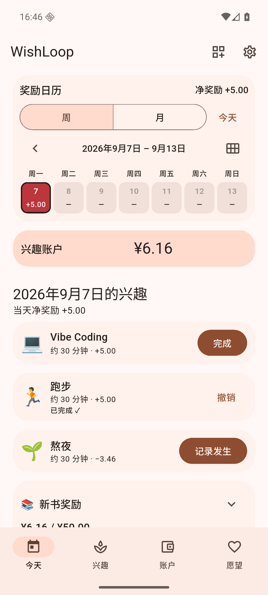
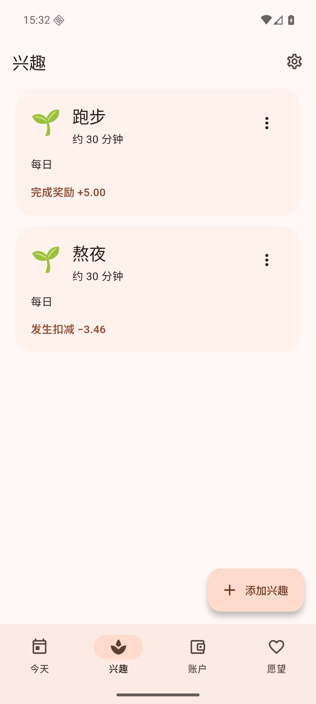
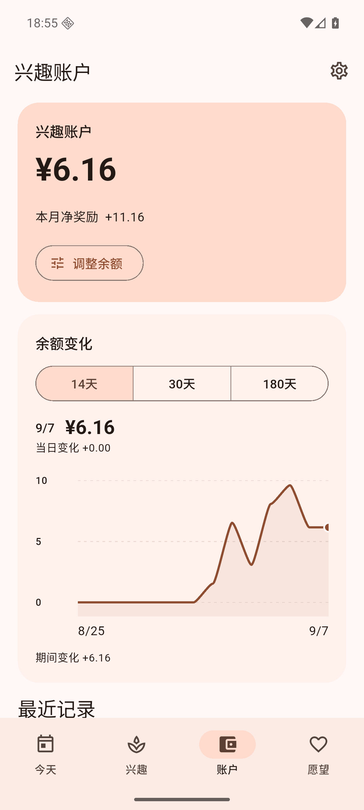
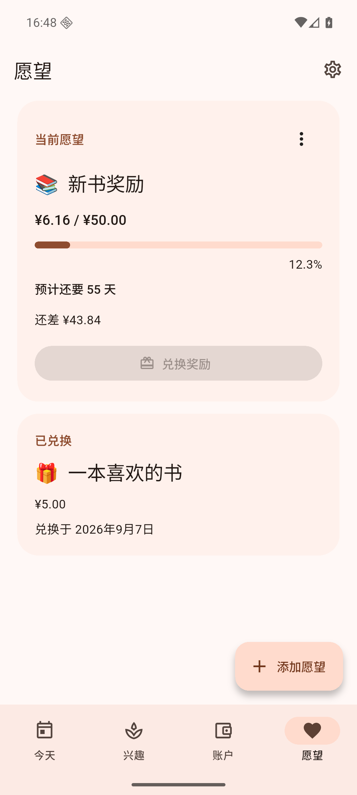
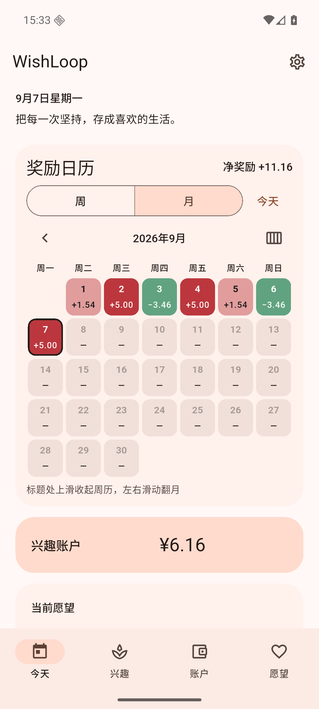
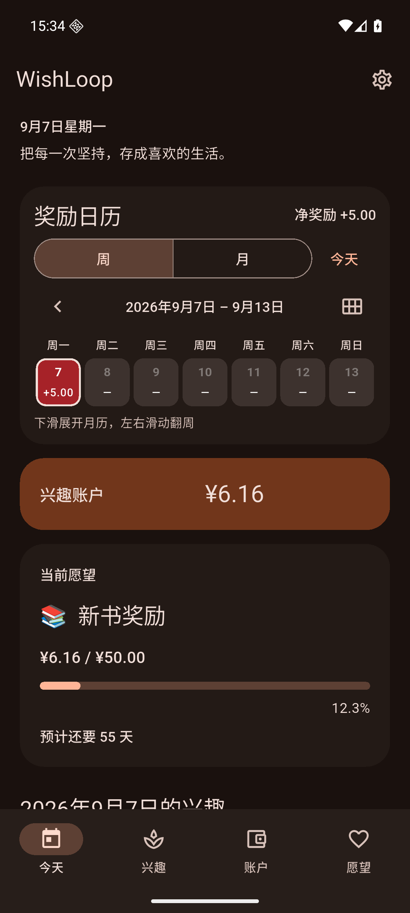
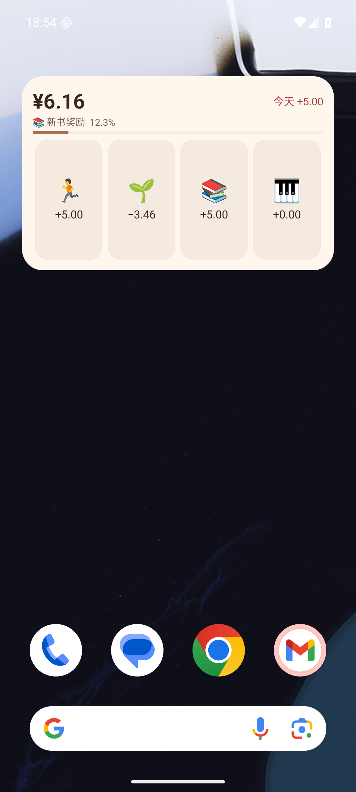
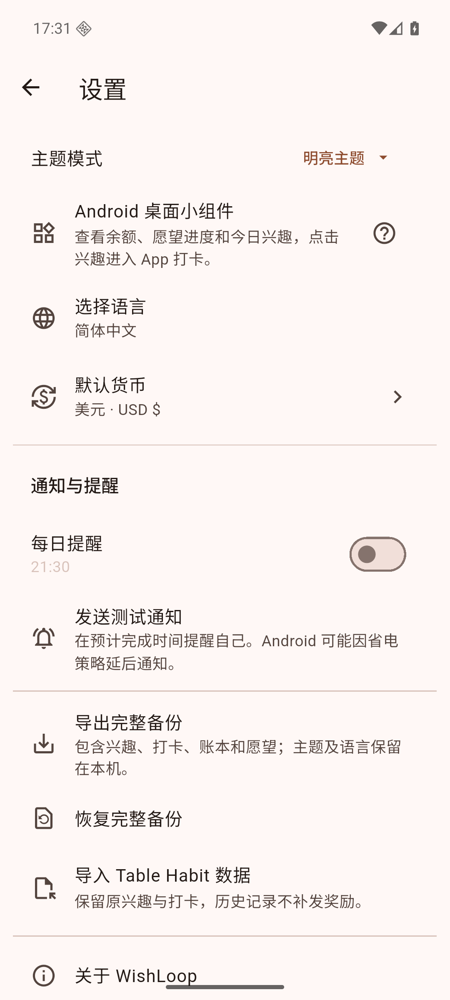

<h1 align="center">WishLoop · 兴趣账户</h1>

<p align="center"><strong>把每一次坚持，存成喜欢的生活。</strong></p>
<p align="center">Android · 完全离线 · 无需登录 · 无广告 · 简体中文优先</p>
<p align="center">
  <a href="https://github.com/kejie-tang/WishLoop/releases/latest"><strong>下载 Android APK</strong></a>
  · <a href="#界面预览">看看实际界面</a>
  · <a href="#开始使用">开始使用</a>
</p>

你有没有一件一直想买、却总觉得“还不到时候”的东西？

WishLoop 让它成为坚持兴趣的理由：为跑步、阅读、学习设定奖励，完成一次，就向自己的兴趣账户记一笔。随着奖励金累积，愿望的进度也一点点向前。

**兴趣 → 打卡 → 累积奖励金 → 兑换愿望**

> 兴趣账户中的金额仅用于个人兴趣激励和虚拟记账。App 不提供真实货币奖励、提现或兑换现金服务；真正购买由你自己决定。

## 界面预览

以下为 **Android 实际截图**，使用演示数据。账户和桌面小组件来自 v1.4.0，货币设置来自 v1.3.0，其余页面来自 v1.2.0。点击图片可查看大图。

<p align="center">
  <a href="docs/screenshots/today.png"></a>
  <a href="docs/screenshots/hobbies.png"></a>
  <a href="docs/screenshots/wallet.png"></a>
</p>

<p align="center">
  <a href="docs/screenshots/wishlist.png"></a>
  <a href="docs/screenshots/calendar-month.png"></a>
  <a href="docs/screenshots/dark-mode.png"></a>
</p>

<p align="center">
  <a href="docs/screenshots/home-widget.png"></a>
  <a href="docs/screenshots/categories.png"></a>
  <a href="docs/screenshots/currency-settings.png"></a>
</p>

## 给坚持一个看得见的理由

奖励规则由你自己决定。例如：

| 兴趣 / 习惯 | 每次记录的虚拟奖励金 |
| --- | ---: |
| 🏃 跑步 30 分钟 | +5.00 |
| 🇬🇧 学英语 20 分钟 | +3.00 |
| 💻 Vibe Coding 30 分钟 | +5.00 |
| 🌙 记录一次熬夜 | −10.00 |

再把一本书、一副耳机，或者其他真正想要的东西放进愿望清单。首页会展示你的主要愿望，让每一次打卡都有一个具体的期待。

- **首页可以更紧凑。** 在首页右上角切换紧凑模式、选择兴趣优先；布局会自动记住。
- **从 Android 桌面开始。** 4×2 小组件显示余额、愿望进度和最多四个未完成兴趣；点击 emoji 直接记录并自动补位，撤销在 App 中操作。
- **按分类整理，按喜好排序。** 支持创建、改名、删除分类与分类筛选；拖动兴趣右侧的排序柄即可调整顺序，首页和小组件同步更新。
- **用曲线回看账户变化。** 最近 14、30、180 天随时切换，平滑曲线保留每天的实际余额，点按或拖动可查看每日变化；收入、扣减、兑换和调整都计入。
- **人民币或美元，由你选择。** 默认人民币，可在设置切换美元；统一更换虚拟记账单位，金额数值不变，不进行汇率换算。
- **奖励与扣减都由你设定。** 支持正数、零和负数金额；输入自动规范为两位小数。
- **按自己的节奏坚持。** 支持每天、每周、每月、自定义周期和指定星期，可设置预计时长与提醒。
- **漏记了，也能补上。** 周/月日历支持左右翻页、选择过去日期补记或撤销；颜色深浅随当前周/月的数据变化。
- **愿望进度随账户更新。** 根据最近 14 天净奖励估算还需多少天；近期没有净增长时显示“暂无法预计”。
- **记错可以撤销。** 完成记录与奖励关联，撤销会恢复对应金额；重复点击不会重复奖励，愿望也只能兑换一次。
- **数据留在你的手机。** 无账号、无后端、无云同步；支持完整备份、恢复，以及导入 Table Habit 的兴趣记录。

桌面小组件默认横向 4 列 × 纵向 2 行，兴趣仅显示 emoji 和金额。升级后请缩放旧组件或重新添加；点击余额或愿望可进入相应页面。

所有愿望共用一个兴趣账户。兑换需要余额充足并二次确认；兑换后，其他愿望的进度也会随余额更新。

## 开始使用

1. **安装 App。** 从 [GitHub Releases](https://github.com/kejie-tang/WishLoop/releases/latest) 下载 APK，在 Android 手机上打开安装；按系统提示允许此次安装来源。
2. **写下一个愿望。** 填写名称和目标金额，设为主要愿望。
3. **添加两三个兴趣。** 填好名称、频率、时长和每次奖励；想记录不好的习惯时，可把金额设为负数。
4. **从今天的一次完成开始。** 在“今天”打卡，查看奖励金与愿望进度；需要时从日历补记或撤销。

桌面小组件可从“设置 → Android 桌面小组件”添加，也可以长按桌面空白处，从系统小组件列表选择 WishLoop。分类从“兴趣 → 管理分类”创建，再在兴趣编辑页分配。

已有积累可以在“账户 → 调整余额”中补入。建议定期使用“设置 → 导出完整备份”，把备份保存到自己的文件目录。

**当前版本：v1.4.0 · 支持 Android 7.0 及以上。** 目前面向个人日常使用，通过 APK 安装。

升级使用同一签名的新版 APK，可覆盖安装保留数据。如果手机已安装官方 Table Habit，两者当前包名相同、签名不同，不能直接覆盖；请先在原 App 导出数据，避免丢失记录。

## 简单使用，也认真对待数据

余额由完整账本求和得到；金额以整数分保存。完成、撤销和愿望兑换通过数据库事务处理，数据库升级保留已有记录。

当前 v1.4.0 已通过 **1406 项 Flutter 测试**、`flutter analyze` 静态检查、release APK 构建及 Android 模拟器验证。详情见 [版本验证记录](docs/wishloop/V1.4.0.md)。实体手机上的通知及时性仍可能受到厂商省电策略影响。

## 开发与文档

基于 **Flutter + Provider + sqflite SQLite + Material 3**。当前开发与验证目标为 Android，保留原有主题和国际化系统；新增功能以简体中文和英文为主。

```sh
flutter pub get
flutter analyze
flutter test
flutter build apk --release
```

构建产物：`build/app/outputs/flutter-apk/app-release.apk`。

- [技术与数据说明](docs/wishloop/TECHNICAL_NOTES.md)：账本、预计天数、数据库迁移、备份与当前限制。
- [Android 构建环境](docs/wishloop/BUILD.md)：Flutter / JDK 版本、构建配置及网络环境说明。
- [vivo / OriginOS 6 小组件说明](docs/wishloop/VIVO-WIDGET.md)：官方添加入口、平台规则与真机验证范围。
- [截图说明](docs/screenshots/README.md)：截图版本与演示数据说明。
- [问题反馈](https://github.com/kejie-tang/WishLoop/issues)：欢迎记录实际使用中遇到的问题。

## 致谢与许可证

WishLoop 基于 [FriesI23/mhabit（Table Habit）](https://github.com/FriesI23/mhabit)，在其兴趣记录、日程、提醒、主题与本地存储基础上，加入奖励账本和愿望闭环。感谢原作者与贡献者。

遵循 [Apache-2.0](LICENSE)，保留原作者版权及 [第三方声明](LICENSE_THIRDPARTY.md)。[参考项目原 README](docs/wishloop/UPSTREAM_README.md) · [列表依赖补丁](vendor/great_list_view/PATCHES.md) · [Android SQLite 并发补丁](android/sqflite_patch/PATCHES.md)。应用图标目前沿用参考项目。
