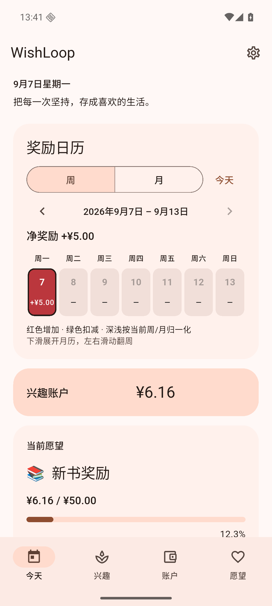
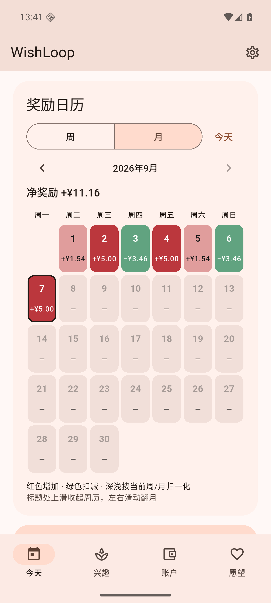
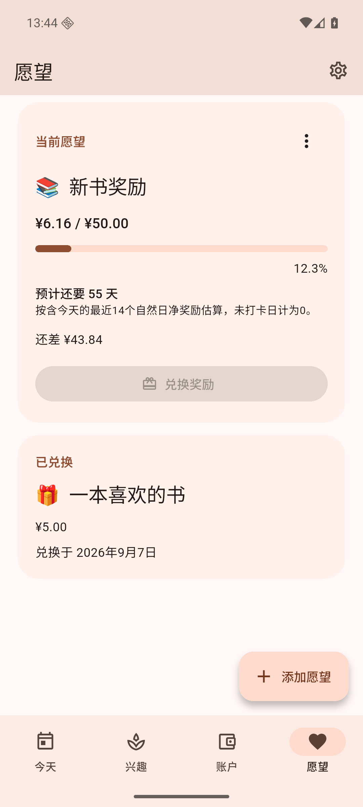

# WishLoop 1.1.0 (196)

日期：2026-09-07；从已发布 1.0.0 继续开发，保留 Provider、sqflite、原频率及提醒系统。

## 本次变化

1. 兴趣每次金额允许负数。负数项使用“记录发生”和“习惯扣减”，原子写入一笔带负数的 EARN；撤销按原数额退回，不会因修改了金额而错账。不好的习惯不会成为获得“全部完成”反馈的前提。
2. 所有金额表单支持自动两位小数：不足补零、超出十进制四舍五入，负数按绝对值舍入后恢复负号。金额仍只以整数分保存和计算。
3. 首页改为周/月奖励日历，红增绿减、零值中性，按当前周期的最大每日绝对净值归一化。左右滑动/按钮翻期，下滑展开月视图，标题处上滑收起周视图；月历日期区域可正常滚动，六行月份及小屏幕仍能选到月末；边界方向保留页面正常滚动与惯性。提供金额和选中状态语义，不只用颜色区分。
4. 点日期补记、撤销；按所选日期写原打卡与账本，实际录入时间仍保存在 completed_at。最早允许 1900 年，不允许提前记录未来日期。延伸开始日期时保持自定义频率的相位，周期次数/星期限制继续生效；可撤销历史归档或删除兴趣的记录。
5. 当前愿望及愿望列表显示预计天数。固定统计含今天的 14 个自然日，0 记录日也占分母，扣减计入，人工调整和兑换排除。`ceil(剩余金额 × 14 / 14天净奖励)`；达标显示达标，合计≤0 不给出无意义天数。

## 数据库与备份

- Schema **9 → 10**；仍兼容上游 v8 数据直接升级。
- 无新增业务表/字段；调整 `mh_habits.reward_minor`、`hw_checkins.reward_minor`、`hw_transactions` 的签名金额约束，新增 `hw_checkins_day` 索引。
- 迁移使用 [SQLite 官方通用 ALTER TABLE 流程](https://www.sqlite.org/lang_altertable.html#making_other_kinds_of_table_schema_changes)：事务前关闭外键、创建新表并复制原数据、替换、恢复索引/触发器/自增序列、检查外键、提交后开启外键。不会删除重建整个数据库。
- 已验证全 8 张表的行完全保留，包含已兑换愿望、关联交易；触发器仍能清理被撤销的旧记录。v9 与 v10 备份都可恢复，损坏关联仍回滚。

## 自动化验证

- 修改前：flutter pub get / analyze 成功，1358 个测试通过。
- 本轮 `dart format .`、`flutter analyze` 通过（No issues found）。
- 本轮 `flutter test`：**1368 passed**，新增 10 个测试。
- 新增数据测试：精确小数舍入、并发负数扣减及撤销、跨月补记与再次完成、删除后的历史撤销、未来日期拒绝/自定义周期相位、14 天统计边界及预测、周/月归一化/零值/闰年/跨年、真实 v9 opener 迁移与旧备份。
- 新增界面测试：周/月/翻期/日期选择/补记撤销；负数金额失焦舍入、扣减与预测提示。原有四页面中文浅深色、英文 1.6 倍字号测试也包含月视图。

## Android 覆盖升级

专用 Android 16 / API 36 模拟器，先保留已安装 1.0.0（195）及其真实 v9 数据，再用 release APK `adb install -r` 覆盖为 1.1.0（196）。启动成功，余额 ¥483、当日净奖励 ¥5、原愿望与进度保留，首页切换为新日历。没有清库升级。

[升级前页面](v110-before-upgrade.txt) · [升级后页面](v110-after-upgrade.txt)

## Android 操作测试

同一专用模拟器另用空白测试数据执行 `integration_test/android_mvp_test.dart`，**1 passed / All tests passed**。实际操作兴趣/愿望表单、完成→撤销→再完成、兑换、备份恢复，输入 `-3.456` 并断言失焦为 `-3.46`，切换月视图、点昨天、负数补记和撤销、左右翻月及回到今天。

随后混合正负历史记录：14 天净奖励合计 ¥11.16、当前余额 ¥6.16、目标 ¥50，UI 显示 **预计还要 55 天**。四页面深色渲染和真实 Android 通知服务也通过。

本轮修复了日历手势吞掉正常页面滚动、六行月份末尾不易点击的问题；Android 自动化辅助方法适配真实键盘收起和临时 Snackbar，最终运行没有漏点警告。

原始记录：[静态检查](v110-analyze.txt) · [1368 个测试](v110-tests.txt) · [Android 集成测试](v110-android-integration.txt)

## 最终 APK

- `WISHLOOP_MAVEN_MIRROR=1 flutter build apk --release` **成功**（45.2 秒）；使用本机构建镜像解决既有网络问题，详见 [BUILD.md](BUILD.md)。[构建日志](v110-build-release.txt)
- 文件：`build/app/outputs/flutter-apk/app-release.apk`；发布附件 `WishLoop-1.1.0.apk`。
- 版本 **1.1.0 / versionCode 196**；大小 **70,802,084 字节**；Android 7.0+。
- SHA-256：`fdf375bf2095f33f66a953db7937ff464156ec2c6a27109f0a544d2baf91763b`。
- [apksigner 校验](v110-apk-signature.txt)成功，签名与 1.0.0 相同，可覆盖安装；[Manifest 检查](v110-apk-badging.txt)确认 21 个语言标签统一 WishLoop，无 INTERNET 权限。
- 最终 release 覆盖测试包后强制停止、重新启动，保留余额 ¥6.16 和预计 55 天。[冷启动记录](v110-release-cold-start.txt)
- 原生触摸验证六行月份：8 月月历滚动后仍保持月视图，成功选中 8 月 31 日。[可访问性状态记录](v110-six-row-scroll.txt)
- 模拟器截图使用测试数据，APK 未包含预置兴趣、交易或愿望。

| 周视图 | 月视图红增绿减 | 愿望预测 |
| --- | --- | --- |
|  |  |  |

## 范围与剩余限制

本轮三项需求均已实现，没有待办的核心业务逻辑。验证设备为 Android 16 / API 36 专用模拟器，尚未在你的实体手机上验证。沿用系统非精确定时提醒，厂商省电策略仍可能延迟通知；日常覆盖安装应继续使用相同签名。

下一步仅建议：真机连续使用一周收集操作反馈；根据实际使用微调日历密度；定期导出并演练恢复个人备份。
