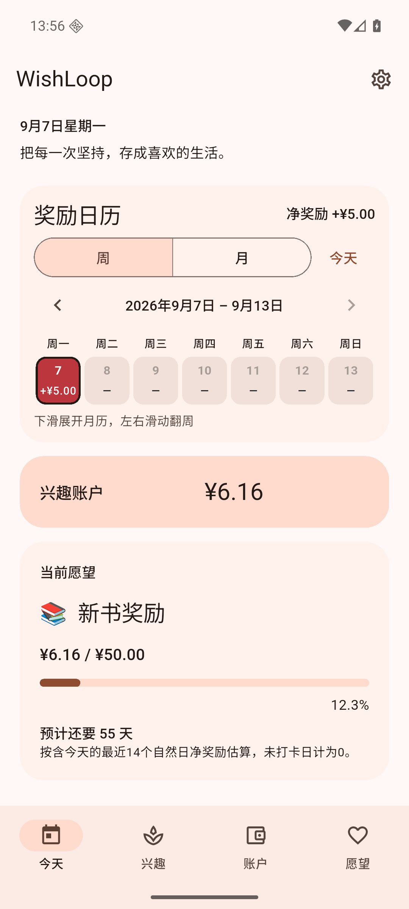
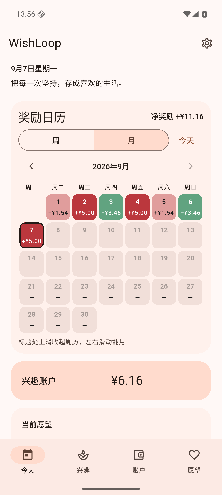

# WishLoop 1.1.1 (197)

日期：2026-09-07。

## 日历布局调整

- 日期格子随宽度调整高度，手机上约 45 × 48 dp，比原来 43 × 72 dp 更接近正方形。日期、正负金额、选中状态仍清楚可见。
- 日历内边距从 20 缩至 14 dp，压缩间距，将净奖励移到标题旁。大字号或窄屏下标题自动换行。
- 去除“红色增加 · 绿色扣减 · 深浅按当前周/月归一化”文字。继续保留颜色、金额和周/月手势提示。
- 同一 Android 模拟器测量，周日历高度 969 → 714 px，减少约 26%；五行月日历 1767 → 1260 px，减少约 29%。首页完整显示当前愿望进度和预计天数。
- 沿用 v10 数据库和原有奖励/补记/撤销/兑换逻辑。

## 验证与 APK

- `dart format .` 通过；[flutter analyze](v111-analyze.txt)：No issues found。
- [flutter test](v111-tests.txt)：**1368 passed**，包括中文浅深色、英文 1.6 倍字号、日历手势、六行月份、补记撤销等现有测试。本次仅调整布局，复用现有回归测试。
- [flutter build apk --release](v111-build-release.txt)：**成功**，62.3 秒；使用既有本机镜像配置 `WISHLOOP_MAVEN_MIRROR=1`。
- Android 16 / API 36 模拟器覆盖安装 release 成功；冷启动保留余额 ¥6.16、预计 55 天。实际下滑展开月历、点较小日期格选中 9 月 6 日、标题上滑回周历均成功。[原生界面记录](v111-native-ui.txt)
- APK：`build/app/outputs/flutter-apk/app-release.apk`，**70,818,468 字节**。发布附件 `WishLoop-1.1.1.apk`。
- SHA-256：`b67854cdf60de31f67ce5f91b6498dec44a28ee05a690a96fee54a82d146ac03`。
- [签名校验](v111-signature.txt)成功，与 1.0.0 / 1.1.0 相同，可直接覆盖安装。尚未在用户实体手机上验证。

| 首页周历 | 月历 |
| --- | --- |
|  |  |

截图中的兴趣和交易是模拟器测试数据，未预装进 APK。
