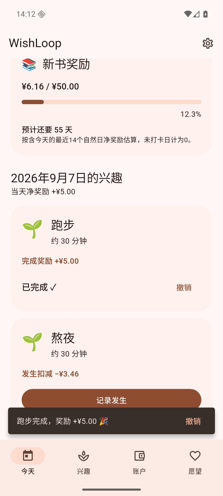
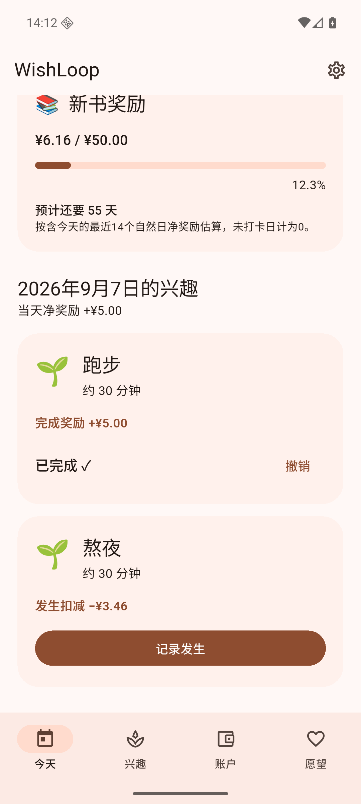

# WishLoop 1.1.2 (198)

日期：2026-09-07。

## 奖励提示自动收起

当前构建所用 Flutter SDK 中，SnackBar 带 action 时默认 `persist = true`，导致带“撤销”按钮的奖励提示不会随 duration 自动消失。

- 完成/扣减提示停留时间设为 **1500 ms**，显式 `persist: false`，随后按系统动画收起。
- 快速连续操作会清除待显示的旧提示，避免排队延长占用。
- 提示中的“撤销”仍可使用；提示消失后，兴趣卡片上的“撤销”继续有效。

## 验证

- `dart format .` 通过；[flutter analyze](v112-analyze.txt)：No issues found。
- [flutter test](v112-tests.txt)：**1368 passed**。扩展原完成/撤销/兑换界面测试：操作弹窗撤销，重新完成后推进实际测试时钟，断言 1 秒时仍显示、2 秒后消失，再从卡片撤销并检查余额和后续兑换。
- Android 16 / API 36 模拟器安装 release 后，用原生触摸完成“跑步”。[截屏计时](v112-native-timing.json)从点击起约 0.65 秒仍显示提示、2.41 秒已经收起，包含进入/退出动画。
- [原生界面检查](v112-native-ui.txt)：提示消失后余额 ¥6.16，卡片撤销后 ¥1.16，再次完成恢复 ¥6.16。
- 验证使用专用模拟器测试数据，尚未在用户实体手机上测试。

| 提示出现 | 自动收起后 |
| --- | --- |
|  |  |

## APK

- [release 构建](v112-build-release.txt)成功（64.8 秒），命令 `WISHLOOP_MAVEN_MIRROR=1 flutter build apk --release`。
- 文件：`build/app/outputs/flutter-apk/app-release.apk`；附件 `WishLoop-1.1.2.apk`；**70,818,468 字节**。
- SHA-256：`f80f10a5fa8366ceaecc965c27a639184a5bda4968f1cd392caa21c09c881412`。
- [签名校验](v112-signature.txt)通过，与旧版相同；覆盖安装成功。
