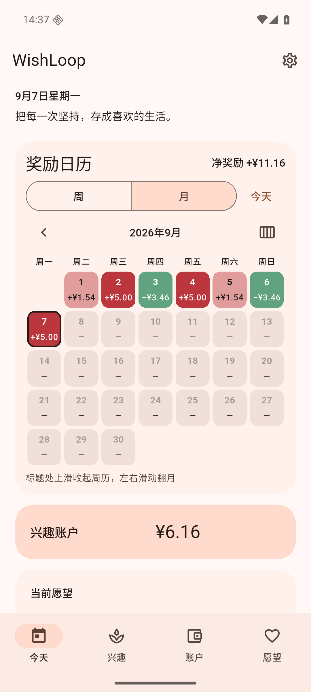

# WishLoop 1.1.3 (199)

日期：2026-09-07。

## 最新周期的周/月切换

按用户确认，修改的是“最新周期再翻下一期”的操作。

- 在最新周继续向下一期翻页：切换为月视图；在最新月继续向下一期翻页：切换为周视图。
- 当前所选日期保持不变，行为与上方周/月按钮一致。如果当前月选中了较早日期，切换后显示那个日期所在的周。
- 最新周期右侧按钮显示目标周/月图标和中文/英文提示，点击同样切换；历史周期显示下一期箭头。
- 仅仅从历史翻回最新周期时仍保留当前模式，要再翻一次才切换。短距离误触不会切换，业务操作忙碌时禁用此操作。
- 保留原有手势方向、历史翻页、下滑展开/标题上滑收起和日期补记机制。

## 验证

- `dart format .` 通过；[flutter analyze](v113-analyze.txt)：No issues found。
- [flutter test](v113-tests.txt)：**1369 passed**。新增回归测试覆盖最新周→月→周、短滑无操作、历史前后翻页、回到最新不同时切换、右侧按钮切换、当前月选较早日期后切周仍保留日期及余额。
- Android 16 / API 36 模拟器安装 release 成功，实际原生滑动与点击验证六条路径：最新周→月、最新月→周、回看上一周、回到最新仍为周、右侧按钮→月、右侧按钮→周。每步检查选中日期，余额均为 ¥6.16。[原生界面记录](v113-native-ui.txt)
- 验证使用专用模拟器测试数据，尚未在用户实体手机上测试。

| 最新周的月视图切换按钮 | 最新月的周视图切换按钮 |
| --- | --- |
|  |  |

## APK

- [release 构建](v113-build-release.txt)成功（63.7 秒），命令 `WISHLOOP_MAVEN_MIRROR=1 flutter build apk --release`。
- 文件：`build/app/outputs/flutter-apk/app-release.apk`；附件 `WishLoop-1.1.3.apk`；**70,884,092 字节**。
- SHA-256：`8ded50f0e1fd7a67127d59ce528f68799559ec937c527dba30f44fb809413cc6`。
- [签名校验](v113-signature.txt)通过，与旧版相同；可直接覆盖安装。
