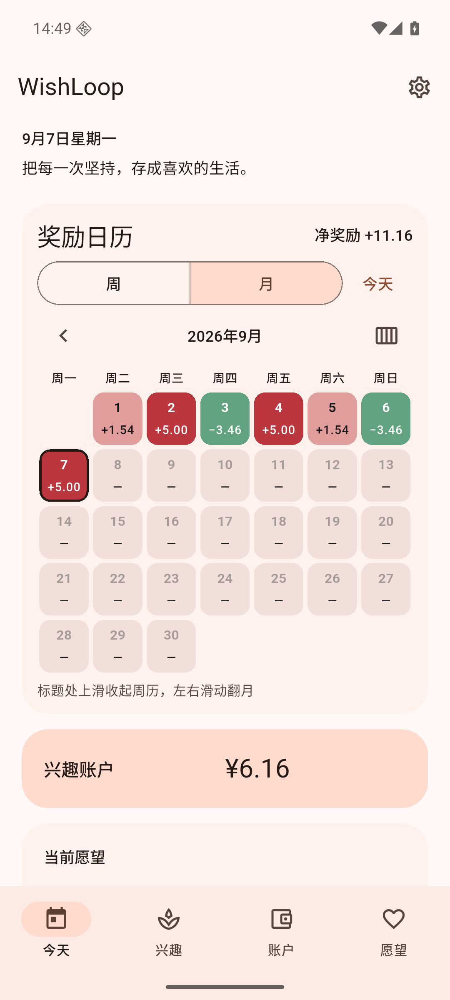
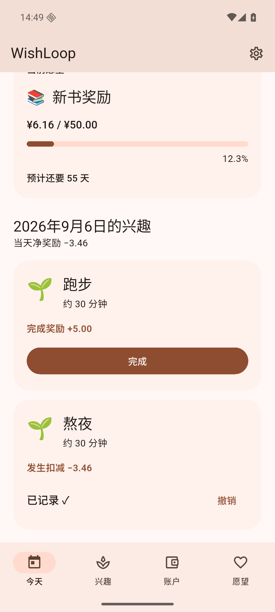

# WishLoop 1.1.4 (200)

日期：2026-09-07。

## 显示精简

- 日历总额和日期格、兴趣奖励、完成反馈及账户流水统一使用 `+20.00` / `−20.00`，省去正负金额中的货币符号。账户余额、愿望价格仍显示货币单位。
- 移除愿望预测下方包含“未打卡日计为0”的说明段落，保留“预计还要 × 天”。
- 移除历史日期下方“补记按当前兴趣规则和金额入账……”说明段落；同步删除中英文及生成的本地化资源。
- 本次仅调整展示，无数据库迁移，账本与预计天数算法保持原有规则。

## 验证

- `dart format .`：814 个文件，0 个需更改。
- [flutter analyze](v114-analyze.txt)：No issues found。
- [flutter test](v114-tests.txt)：**1369 passed**，运行现有全量测试，包括账本正确性、数据库迁移、日历、愿望预计天数和四个页面。
- Android 16 / API 36 专用模拟器覆盖安装 release 成功，检查周/月日历、历史日期、兴趣、账户、愿望。正负数字和两位小数显示正常，两段说明均不再出现；已有测试余额 ¥6.16、历史记录、愿望及预计 55 天保留。[原生界面记录](v114-native-ui.txt)
- 使用专用模拟器的测试数据，未在用户实体手机上测试。

| 月历金额 | 历史日期与愿望 |
| --- | --- |
|  |  |

## APK

- [release 构建](v114-build-release.txt)成功（63.6 秒），命令 `WISHLOOP_MAVEN_MIRROR=1 flutter build apk --release`。
- 文件：`build/app/outputs/flutter-apk/app-release.apk`；附件 `WishLoop-1.1.4.apk`；**70,818,556 字节**。
- SHA-256：`6b8ad1ecc6de0e7a59cd0e008c0b1477e26bd5c622a62ff1f5d2705ade359337`。
- [签名校验](v114-signature.txt)通过，与旧版相同，可直接覆盖安装。
