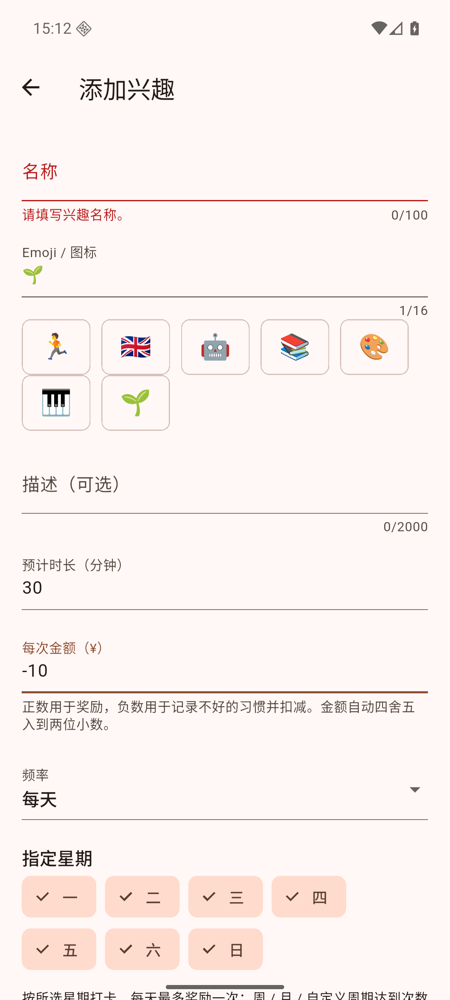

# WishLoop 1.1.5 (201)

日期：2026-09-07。

## 兴趣名称校验

用户在名称留空、金额输入 `-10` 时收到包含金额的通用错误提示，容易误以为不支持负数。名称与金额原先共用同一条文案。

- 名称为空时显示“请填写兴趣名称。”，保存时自动回到名称输入框。
- 先检查名称控制器，保证滚动到底部后仍会检查必填名称；其他已显示的无效字段也会自动定位。
- 填好名称后立即清除该字段的错误提示，保留已输入的 `-10` 和其他内容。
- 金额解析与数据库规则未改动。标准 `-10` 本来就是有效金额，保存为整数分 `-1000`。

## 验证

- `dart format .` 完成；[flutter analyze](v115-analyze.txt)：No issues found。
- [flutter test](v115-tests.txt)：**1370 passed**。新增回归覆盖名称留空、有效负数金额、定位提示、补名称后提示消失并成功保存，以及没有新增账本交易。
- Android 16 / API 36 专用模拟器覆盖安装 release 成功；实际输入 `-10`，名称留空点击保存，页面自动回到名称并显示专属提示；补上名称后保存成功，兴趣显示扣减 `−10.00`，余额仍为 ¥6.16。[原生界面记录](v115-native-ui.txt)
- 模拟器使用专用测试数据，未在用户实体手机上测试。

| 缺少名称的提示 | 补名称后保存成功 |
| --- | --- |
|  |  |

## APK

- [release 构建](v115-build-release.txt)成功（65.0 秒），命令 `WISHLOOP_MAVEN_MIRROR=1 flutter build apk --release`。
- 文件：`build/app/outputs/flutter-apk/app-release.apk`；附件 `WishLoop-1.1.5.apk`；**70,884,092 字节**。
- SHA-256：`90844052e7f92552c93745721f1d1da36012bb2a16609df5ea78ea3db2133e39`。
- [签名校验](v115-signature.txt)通过，与旧版相同，可覆盖安装保留数据。
