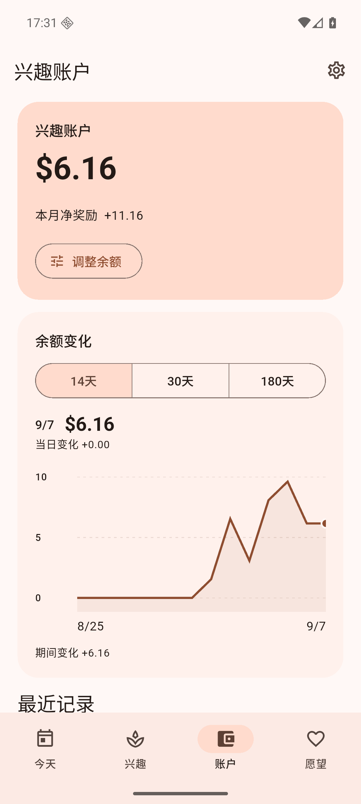

# WishLoop 1.3.0（203）

2026-09-07。本版增加账户变化曲线、人民币/美元切换，并核查 vivo / OriginOS 6 桌面小组件规则。继续使用 Provider、sqflite、Material 3 和原有国际化、提醒系统，没有新增依赖或服务端功能。

## 使用方式

- **账户 → 余额变化**：切换最近 14、30、180 天；点按或在曲线上滑动，查看指定日期的余额与当日变化。默认选中今天。
- **设置 → 默认货币**：默认人民币 CNY ¥，可切换美元 USD $。二次确认后统一变更虚拟记账单位，所有金额数值保持不变，不按汇率转换。
- **设置 → Android 桌面小组件右侧问号**：查看手动添加帮助，包含 vivo 的原子组件入口。平台依据和未验证范围见 [vivo / OriginOS 6 说明](VIVO-WIDGET.md)。

  
  

## 数据和实现

曲线按完整账本计算每日结束余额，包括 EARN、SPEND 和 ADJUSTMENT。空白日期结转余额；早于区间的记录计入期初余额；不会截断为最近 200 条流水。打卡沿用所属日期，调整和兑换使用本地日期。补记、撤销后重新计算，首页选择历史日期不会改变曲线的今天基准。金额汇总、结转和日变化全部使用整数分；仅绘图坐标转为 double。复用项目已有的 `fl_chart`。

数据库版本 **10 → 11**：

- 新增 `hw_settings(id, currency)` 单行表，默认 CNY。
- 保留 `hw_transactions.currency` 现有列，将约束扩展为 CNY / USD；没有新增兴趣字段。
- 复制/替换表的正式迁移保留原账本、索引、触发器、外键关系，提交前检查外键。
- 货币切换在同一事务中更新设置及全部账本行的币种；新收入、兑换、调整读取同一设置，触发器拒绝混用币种。金额数值、愿望价格、历史奖励均不改变。
- 新备份包含货币设置，支持恢复 schema 9 / 10 / 11 的完整备份；旧备份自动补入默认 CNY。非法币种或不一致账本恢复失败时完整回滚。

UI、桌面小组件、兴趣提醒使用选定货币。带正负号的奖励仍显示 `+20.00` / `−3.46`，保持不重复添加货币符号的已有约定。新增文案提供简体中文、繁体中文和英文。

## 检查结果

| 检查 | 真实结果 |
| --- | --- |
| 修改前 `flutter pub get` | 成功 |
| 修改前 `flutter analyze` / `flutter test` | 无问题 / 1383 项通过 |
| `dart format .` | 完成 |
| 最终 `flutter analyze` | **No issues found!** |
| 最终 `flutter test --reporter expanded` | **1399 项全部通过**，约 49 秒 |
| `WISHLOOP_MAVEN_MIRROR=1 flutter build apk --release` | **成功**，Gradle 约 62 秒 |
| Android 覆盖安装 | 从 1.2.0（202）覆盖安装至 1.3.0（203）成功 |

新增 16 项测试：

- `balance_currency_test.dart`（13 项）：空账本 180 天、期初结转与全部流水类型、230 条流水突破列表限制、本地午夜/闰日边界、补记/撤销/再完成、币种持久化及后续记账、非法及混合币种拒绝、并发切换与去重、整数金额格式、桌面美元缓存、货币备份恢复、旧备份与损坏备份回滚、真实 v10 → v11 迁移。
- `pages_test.dart`（3 项）：三种区间及点选日期、货币切换取消与确认后的显示、180 天负余额在深色/两倍字号下的布局。原有四页渲染、完成/撤销、兑换、分类与拖动测试继续通过。
- 原 v8、v9 迁移测试升级为验证迁移到 v11，保留旧数据、序列和清理触发器的检查。

Android 16 / API 36 专用模拟器实际验证：

- 从 v1.2.0 原数据库升级；原八张业务表逐行一致，余额仍为 `616` 分，原分类、顺序、9 条兴趣记录、10 条账本、2 个愿望和1次兑换保留；外键检查无错误。
- 14 天显示 `8/25–9/7`、30 天显示 `8/9–9/7`、180 天显示 `3/12–9/7`。点选 9 月 3 日显示余额 `3.08`、当日 `−3.46`。
- 切换美元后，账户和桌面显示 `$6.16`；从桌面组件冷启动到账户仍保留美元。
- 从组件打开负数兴趣并记录：`$6.16 → $2.70`，桌面同步；数据库新增一条 `−346` 分 USD 记录，全部账本币种均为 USD。撤销后恢复 `6.16`，最终切回 CNY 后账本仍为 10 条，没有重复或孤立记录。
- 180 天深色曲线、货币确认弹窗、设置帮助正常显示；当前 App 进程日志没有 Flutter 错误或致命异常。

测试仅使用专用模拟器和演示数据，没有连接或修改用户实体手机数据。

## APK

- 路径：`build/app/outputs/flutter-apk/app-release.apk`
- 发布副本：`build/app/outputs/flutter-apk/WishLoop-1.3.0.apk`
- 大小：**72,626,264 字节**。
- SHA-256：`6167e2dc6ad0742e5ce89098722446c78ecd5d0c28edd083a8c60d9f07b9c079`
- 版本：1.3.0（203）；Android 7.0 / API 24 及以上；应用显示名称 WishLoop。
- Application ID：`io.github.friesi23.mhabit`，保持不变；release Manifest 无 INTERNET 权限。
- 签名证书 SHA-256：`e044c8f329f42465866add4d041f29c498009361241610c8ee2de43ae6e87a45`，与旧版相同，可覆盖安装。
- 使用现有自用 debug key 签署 release；未加入商店签名流程。

## 已知限制

- **没有 OriginOS 6 真机实测**。标准 Android 小组件的添加入口和后台更新受系统桌面控制；不能据模拟器通过推断 vivo 专属原子组件、负一屏或锁屏组件已适配。
- 只有一个虚拟账户，货币选择为 CNY / USD；不提供多币种账户、汇率或金额自动换算。
- Android 系统后台刷新和提醒可能受省电策略延迟；App 内数据变更主动更新小组件。
- 构建保留原 AGP 8.13.2，Flutter 给出未来兼容性提醒；本次检查与 release 构建均已成功，没有为此扩大重构范围。
