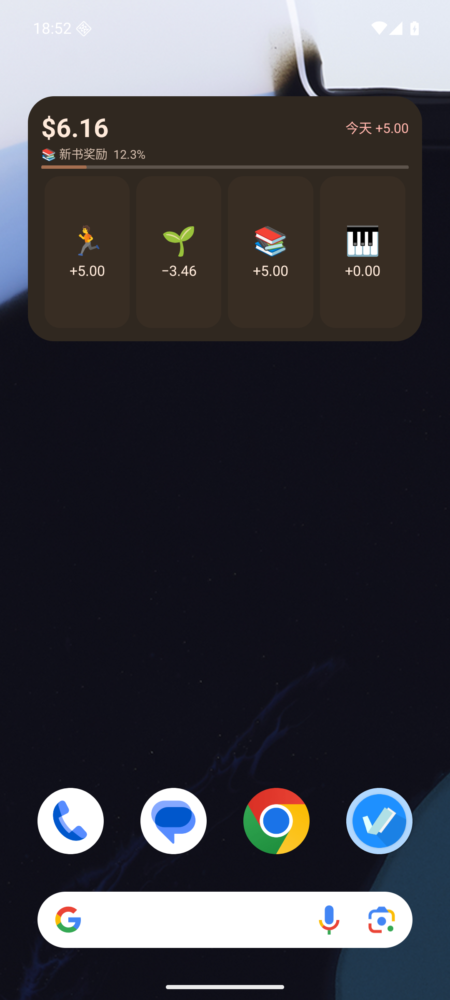

# WishLoop 1.4.0（204）

2026-09-07。本版增加账户曲线平滑，将 Android 桌面小组件改为横向 4 列 × 纵向 2 行，并支持直接点击 emoji 完成今日兴趣。

## 使用方式

- **账户**：14、30、180 天曲线均采用轻度平滑，并启用过冲抑制；每日余额、当日变化与点选结果仍来自原账本，不做移动平均或改写金额。
- **桌面**：最多显示四个今日未完成兴趣，仅显示 emoji 与带正负号的金额。顺序沿用兴趣页排序，点一个完成后立即移除并补入下一项。支持正数、负数和零金额。
- **撤销**：进入 App 的今天页面撤销，组件会重新显示该兴趣。余额和愿望区域仍可点击进入相应页面。
- **升级尺寸**：桌面会保留旧组件大小。请缩放为 4 列 × 2 行，或移除旧组件后从设置 / 系统组件列表重新添加。

## 实现与数据

`PendingIntent.getBroadcast → AppWidgetProvider → JobScheduler / JobService → 无界面 FlutterEngine → WishLoopWidgetAction → HobbyWalletRepository.complete`。点击 emoji 不启动 Activity；账本操作全部复用原有 Dart Repository，没有另写原生记账逻辑。

完成仍在一个 SQLite 事务中写入原兴趣记录、完成记录与一笔 EARN；重复完成由唯一键及事务去重。请求携带日期和当时的奖励金额，在事务内校验，防止跨天或兴趣已修改时按旧内容入账。完成后从数据库重新生成展示缓存，通知已运行的 App 刷新。缓存使用递增代数，避免两个引擎的旧结果覆盖新结果。

组件作业短时排队，过期或被系统终止的请求不会自动重放。执行中断时提示核对状态，避免 App 已撤销后后台旧请求重新入账。Android 12 及以上优先使用 expedited job，额度不足时退回普通 JobScheduler；没有前台服务、额外权限、网络或 vivo SDK。

数据库仍为 **v11**，**没有新增表或字段，也不删除重建数据库**。针对 App 与后台引擎的独立连接，对现有 sqflite Android 单线程调度器增加事务归属控制：当前连接提交或回滚后，才调度其他连接，避免 BEGIN 阻塞 COMMIT。保留原插件与单线程，配置 5 秒 SQLite 锁等待；仅覆盖一个上游 Java 源文件，不修改全局 pub 缓存。构建时核对上游文件哈希，插件变化必须复审补丁。详见 [补丁说明](../../android/sqflite_patch/PATCHES.md)。

## 验证记录

| 检查 | 真实结果 |
| --- | --- |
| 修改前 `flutter pub get` | 成功 |
| 修改前 `flutter analyze` / `flutter test` | 无问题 / 1399 项通过 |
| `dart format .` | 完成 |
| 最终 `flutter analyze` | **No issues found!** |
| 最终 `flutter test --reporter expanded` | **1406 项全部通过**，约 49 秒 |
| Android 三连接并发回归 | **1 项通过**；3 个独立连接、12 轮竞争、单笔记账、关闭与撤销 |
| `:app:testF_genericReleaseUnitTest` | **2 项通过**；后台与页面快照排序及并行代数去重 |
| `WISHLOOP_MAVEN_MIRROR=1 flutter build apk --release` | **成功**，Gradle 约 101 秒 |

新增 `widget_action_test.dart` 七项测试：四项上限和排序补位、并发点击与撤销再完成、负数/零金额及 USD、奖励修改后的旧请求拒绝、跨天校验、非法/缺失/归档兴趣、后台更新通知页面。更新原有快照和曲线渲染测试。原账本、迁移、备份、货币与四页渲染测试继续通过。

新增 `integration_test/widget_concurrency_test.dart` 使用 f_dev 测试包，在 Android 16 / API 36 专用模拟器上运行，能复现原调度器的锁争用；最终补丁通过全部竞争步骤。测试与截图仅使用模拟器演示数据，不接触实体手机数据。

模拟器实际验证：

- 从 1.3.0 覆盖安装时原八张业务表逐行一致，余额仍为 616 分，数据库保持 v11，外键检查无错误。
- 新添加的系统组件明确显示“宽 4，高 2”；旧组件可缩放至两行。
- 结束 App 进程后点击 emoji 保持在系统桌面，完成后余额立即刷新；五个未完成兴趣只显示前四个，完成第一项后第五项补位。
- 连续点击仅产生一条收入；零金额记录后移除对应项，金额不变；App 撤销后组件恢复该兴趣，再次完成余额正确。
- 最终 release APK 在美元、深色模式下冷启动记录负数兴趣：`$6.16 → $2.70`，只新增一条 −346 分 USD 流水。App 撤销后恢复 616 分；切回 CNY 后原金额不变。
- 账户的 14、30、180 天曲线正常渲染并可切换，平滑后的点选值沿用账本计算。
- 两个桌面组件同时显示时，CNY / USD 切换均刷新为相同余额，没有卡住或错误状态；最终恢复 CNY、616 分、10 条账本，外键检查无错误。最终进程日志未发现数据库锁等待、组件超时或 Flutter 异常。

  
  
  

## APK

- 路径：`build/app/outputs/flutter-apk/app-release.apk`
- 发布副本：`build/app/outputs/flutter-apk/WishLoop-1.4.0.apk`
- 大小：**72,627,648 字节**。
- SHA-256：`9ab9a97e7fc2e7496df990af0c59a7a506ed7b58b187d652fa7920f8c50ebe68`
- WishLoop **1.4.0（204）**，Android 7.0 / API 24 及以上，target API 36。
- Application ID 保持 `io.github.friesi23.mhabit`；release Manifest 无 INTERNET 权限，非 debuggable。
- 签名证书 SHA-256：`e044c8f329f42465866add4d041f29c498009361241610c8ee2de43ae6e87a45`，与旧版相同，可覆盖安装；沿用自用 debug key 签署 release。

## 已知限制

- **尚无 OriginOS 6 真机验证**。Android 标准组件支持广播按钮交互；vivo 实际添加、调度速度与省电限制仍由具体系统桌面决定。官方依据与范围见 [vivo / OriginOS 6 说明](VIVO-WIDGET.md)。
- 旧组件不会由 App 强制改变桌面尺寸，需要用户缩放或重新添加。
- 后台调度被限制、超时或进程中断时，可能需要再次点击或打开 App 核对；不能把未更新的组件数值当作记录成功。
- 保留原包名和自用签名方式；Android 构建仍有现有 Gradle / AGP 的未来兼容性提醒，没有为此扩大技术栈重构。
