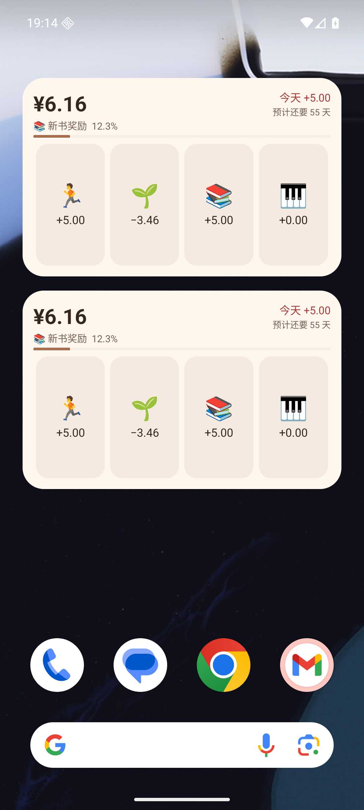

# WishLoop 1.4.1（205）

2026-09-07。本版在 Android 4×2 桌面小组件的今日金额下方加入主要愿望的预计天数，点击可进入愿望页。

## 显示规则

- 使用与 App 相同的最近 14 天净奖励及当前账本余额，向上取整计算「预计还要 X 天」。
- 近 14 天净奖励为零或负数时显示「暂无法预计」；余额足够时显示「已达到目标」。
- 没有有效主要愿望时隐藏预计天数；完成、撤销、调整及愿望更新均沿用已有刷新机制。
- 不增加独立整行占用，保持 4×2 布局、emoji 点击打卡及浅色 / 深色主题。简体中文、繁体中文和英文均已本地化。
- 数据库保持 v11，没有新增表、字段或迁移。预计天数只加入展示缓存，复用 `WishlistItem.estimatedDays`。

## 验证

| 检查 | 结果 |
| --- | --- |
| `flutter pub get` | 成功 |
| `dart format .` | 完成 |
| `flutter analyze` | No issues found! |
| `flutter test --reporter expanded` | 1408 项全部通过，约 51 秒 |
| `WISHLOOP_MAVEN_MIRROR=1 flutter build apk --release` | 成功，Gradle 93.2 秒 |
| 覆盖安装 | v1.4.0 → v1.4.1 成功；8 张业务表逐行一致，外键检查无错误 |

新增两项快照集成测试，验证 14 天边界、人工调整不计入净奖励、向上取整、撤销后更新、无净收入但余额达标、兑换及非主要愿望隐藏。现有测试补充正负净奖励与达标的显示断言。

Android 16 / API 36 专用模拟器使用演示数据验证：

- 两个桌面组件同时显示「预计还要 55 天」。
- 结束 App 进程后点击跑步 emoji，保持系统桌面，余额从 616 分变为 1116 分；两个组件均更新为「34 天」。
- 点击预计天数打开愿望页，显示同样的 34 天。
- 在 App 撤销后，余额恢复 616 分、10 条流水，两个组件均恢复 55 天。
- 浅色及深色下显示正常，没有增加组件尺寸。

## APK

- `build/app/outputs/flutter-apk/app-release.apk`
- 发布副本：`build/app/outputs/flutter-apk/WishLoop-1.4.1.apk`
- 大小：72,627,776 字节。
- SHA-256：`d7b33f4683544c7087b0b4084234c966e0b63dcf9d65c4cef316c9ec94eead30`
- 版本：1.4.1（205），最低 Android 7.0 / API 24，target API 36。
- Application ID 仍为 `io.github.friesi23.mhabit`；签名证书与旧版一致，可覆盖安装。

## 限制

尚无 OriginOS 6 真机验证，厂商后台调度可能延迟小组件刷新。保留原包名及自用签名；Android 构建的既有 Gradle / AGP 未来兼容性提醒未变。
